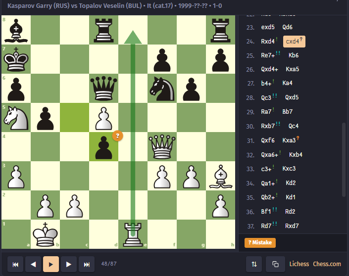

# ♟ ChessView

An interactive chess board plugin for [Obsidian](https://obsidian.md). Render games from PGN, display positions from FEN, solve puzzles, draw arrows and circles, navigate moves with keyboard shortcuts, and analyze on Lichess or Chess.com — all inside your notes.



<!-- TODO: Add a banner screenshot showing a game with move list, arrows, and annotations -->

## Features

- **PGN Games** — Paste any PGN and get a fully navigable game viewer
- **FEN Positions** — Display static or interactive positions from FEN strings
- **Puzzle Mode** — Create solvable puzzles with hints and solution reveal
- **Move Annotations** — NAG symbols (!, ?, !!, ??, !?, ?!) with colored overlays like Chess.com/Lichess
- **Arrows & Circles** — Draw annotations on the board using markers or PGN comments
- **Comments** — Display inline PGN comments with move highlighting
- **Branching** — Explore alternative lines in editable mode
- **Themes** — 7 built-in board themes + custom colors
- **Piece Sets** — 20 piece set options
- **Keyboard Navigation** — Arrow keys, Home/End, Space for autoplay
- **Analysis Links** — One-click export to Lichess and Chess.com
- **Mobile Friendly** — Responsive layout that adapts to any screen size
- **Dark Mode** — Full support for Obsidian's dark theme

## Installation

### From Obsidian Community Plugins (Recommended)

1. Open **Settings** → **Community Plugins** → **Browse**
2. Search for **ChessView**
3. Click **Install**, then **Enable**

### Manual Installation

1. Download `main.js`, `manifest.json`, and `styles.css` from the [latest release](https://github.com/tuxitop/chessview/releases)
2. Create a folder `.obsidian/plugins/chessview/` in your vault
3. Copy the three files into that folder
4. Restart Obsidian and enable the plugin in **Settings** → **Community Plugins**

## Usage

Create a fenced code block with the language `chessview`:

### Display a PGN Game

````
```chessview
[Event "World Championship"]
[White "Kasparov, Garry"]
[Black "Topalov, Veselin"]
[Result "1-0"]

1. e4 d6 2. d4 Nf6 3. Nc3 g6 4. Be3 Bg7 5. Qd2 c6 6. f3 b5
2. Nge2 Nbd7 8. Bh6 Bxh6 9. Qxh6 Bb7 10. a3 e5 11. O-O-O Qe7
3. Kb1 a6 13. Nc1 O-O-O 14. Nb3 exd4 15. Rxd4 c5 16. Rd1 Nb6
4. g3 Kb8 18. Na5 Ba8 19. Bh3 d5 20. Qf4+ Ka7 21. Rhe1 d4
5. Nd5 Nbxd5 23. exd5 Qd6 24. Rxd4 cxd4 25. Re7+ Kb6
6. Qxd4+ Kxa5 27. b4+ Ka4 28. Qc3 Qxd5 29. Ra7 Bb7
7. Rxb7 Qc4 31. Qxf6 Kxa3 32. Qxa6+ Kxb4 33. c3+ Kxc3
8. Qa1+ Kd2 35. Qb2+ Kd1 36. Bf1 Rd2 37. Rd7 Rxd7
9. Bxc4 bxc4 39. Qxh8 Rd3 40. Qa8 c3 41. Qa4+ Ke1
10. f4 f5 43. Kc1 Rd2 44. Qa7 1-0
```
````

### Display a FEN Position

````
```chessview
rnbqkbnr/pppppppp/8/8/4P3/8/PPPP1PPP/RNBQKBNR b KQkq - 0 1
```
````

### Create a Puzzle

````
```chessview
[puzzle]
[rating: 1500]
[title: Scholar's Mate]
---

[FEN "r1bqkb1r/pppp1ppp/2n2n2/4p2Q/2B1P3/8/PPPP1PPP/RNB1K1NR w KQkq - 4 4"]

1. Qxf7#
```
````

### Board Orientation

````
```chessview
[black]
[Event "My Game"]

1. e4 e5 2. Nf3 Nc6 3. Bb5
```
````

Available markers:

- `[white]` — White at bottom (default)
- `[black]` or `[flip]` — Black at bottom

### Static Board (No Interaction)

````
```chessview
[static]
rnbqkbnr/pppppppp/8/8/4P3/8/PPPP1PPP/RNBQKBNR b KQkq - 0 1
```
````

### Arrows and Circles

Using markers before the PGN/FEN:

````
```chessview
[arrow: e2e4 green]
[arrow: d2d4 blue]
[circle: f3 red]

rnbqkbnr/pppppppp/8/8/8/8/PPPPPPPP/RNBQKBNR w KQkq - 0 1
```
````

Using standard PGN comment annotations:

````
```chessview
[Event "Arrow Demo"]

1. e4 {[%cal Ge2e4,Rd7d5] [%csl Gd4,Re5]} e5 2. Nf3
```
````

Arrow/circle color codes: `G` = green, `R` = red, `B` = blue, `Y` = yellow, `O` = orange, `P` = purple

### Move Annotations (NAGs)

Inline annotations:

````
```chessview

1. e4! e5 2. Nf3!! Nc6? 3. Bb5?! a6!? 4. Ba4 Nf6??
```
````

PGN standard NAGs:

````
```chessview

1. e4 $1 e5 $2 2. Nf3 $3 Nc6 $4 3. Bb5 $5 a6 $6
```
````

| Symbol | NAG  | Meaning          |
| ------ | ---- | ---------------- |
| `!`    | `$1` | Good move        |
| `?`    | `$2` | Mistake          |
| `!!`   | `$3` | Brilliant move   |
| `??`   | `$4` | Blunder          |
| `!?`   | `$5` | Interesting move |
| `?!`   | `$6` | Dubious move     |

### Comments

````
```chessview
1. e4 {The King's Pawn opening} e5 {A solid response}
2. Nf3 {Developing the knight toward the center} Nc6
```
````

### Start at a Specific Move

````
```chessview
[move: 15]
[Event "My Game"]

1. e4 e5 2. Nf3 Nc6 3. Bb5 a6 ...
```
````

### Puzzle with Hints and Themes

````
```chessview
[puzzle]
[rating: 2100]
[title: Find the winning combination]
[themes: sacrifice, fork]

---

[FEN "r2qr1k1/ppp2ppp/2np1n2/2b1p1B1/2B1P1b1/2NP1N2/PPP2PPP/R2QR1K1 w - - 0 1"]

1. Bxf7+ Kh8 2. Ng5
```
````

## Marker Reference

| Marker                  | Description                       |
| ----------------------- | --------------------------------- |
| `[white]`               | White at bottom                   |
| `[black]` or `[flip]`   | Black at bottom                   |
| `[static]`              | No interaction, view only         |
| `[noeditable]`          | Can navigate but not make moves   |
| `[move: N]`             | Start at move N                   |
| `[arrow: e2e4 color]`   | Draw arrow (color optional)       |
| `[circle: e4 color]`    | Draw circle (color optional)      |
| `[highlight: e4 color]` | Highlight square (color optional) |
| `[puzzle]`              | Enable puzzle mode                |
| `[rating: N]`           | Puzzle rating                     |
| `[title: text]`         | Puzzle title                      |
| `[themes: a, b, c]`     | Puzzle themes                     |

## Keyboard Shortcuts

| Key     | Action                |
| ------- | --------------------- |
| `←`     | Previous move         |
| `→`     | Next move             |
| `Home`  | First move            |
| `End`   | Last move             |
| `Space` | Play / Pause autoplay |
| `F`     | Flip board            |

_Click on the board first to focus it for keyboard shortcuts._

## Settings

Access via **Settings** → **Community Plugins** → **ChessView** → ⚙️

- **Board Theme** — Brown, Blue, Green, Purple, Gray, Wood, Marble, or Custom
- **Board Size** — Small (280px), Medium (360px), Large (480px), or Auto
- **Piece Set** — 20 options including Cburnett (default), Merida, Alpha, California, and more
- **Notation Style** — Figurine (♞f3) or Letter (Nf3)
- **Coordinates** — Show/hide rank and file labels
- **Colors** — Customize last move highlight, check highlight, arrows, circles
- **Animation Speed** — 0–500ms
- **Autoplay Speed** — 200–3000ms
- **Move List Position** — Right of board or below
- **Analysis Links** — Show/hide Lichess and Chess.com links
- **Default Orientation** — White, Black, or Auto (based on side to move)
- **Puzzle Hints** — Enable/disable hint button in puzzle mode

## Compatibility

- **Obsidian** — v1.0.0 and above
- **Platforms** — Desktop (Windows, macOS, Linux) and Mobile (iOS, Android)
- **Themes** — Works with both light and dark themes

## Credits

- [Chessground](https://github.com/lichess-org/chessground) — Chess board UI by Lichess
- [chess.js](https://github.com/jhlywa/chess.js) — Chess logic library

## License

[MIT](LICENSE)
